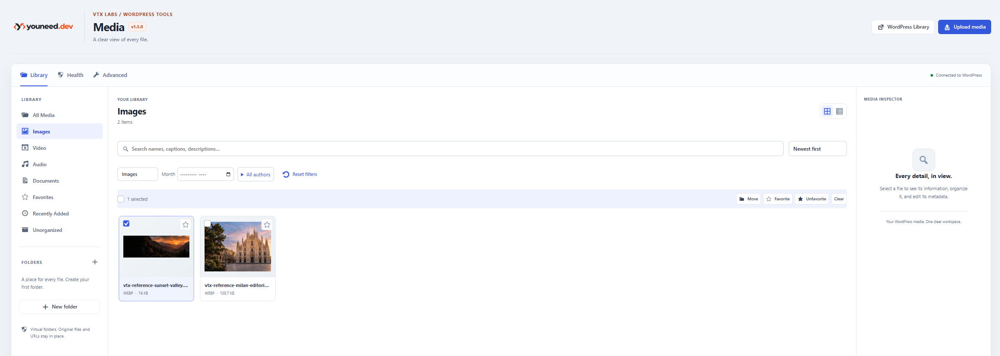
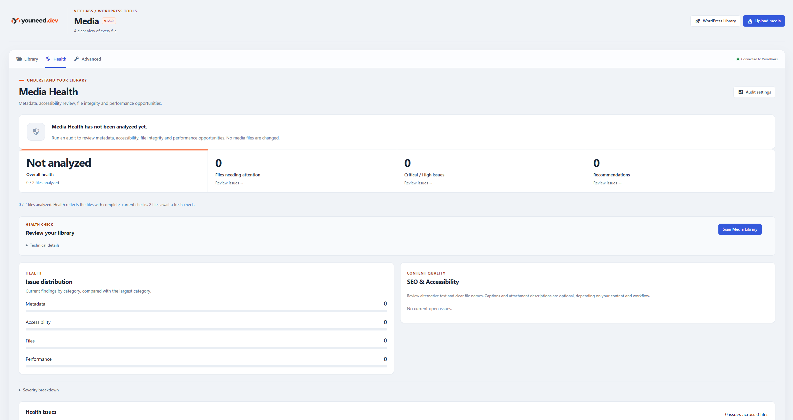
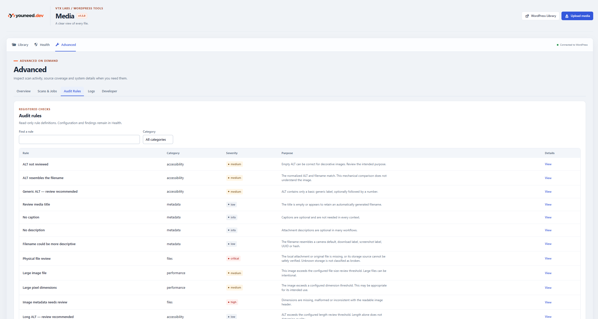

# VTX Media

**WordPress media library management and media-health auditing.** VTX Media Core 1.5.0 provides virtual folder organization, personal favorites, metadata inspection, and deterministic media-health analysis without relocating or deleting WordPress attachments.

## Features

- Nested virtual folders, search, filtering, sorting, and bulk organization.
- Per-user favorites and attachment metadata editing.
- Incremental media-health auditing with resumable scans and issue inspection.
- Capability checks, REST API endpoints, and extension registries for optional modules.
- React-powered WordPress admin interface.

**Scope:** This repository contains the **Core** plugin, not the separately distributed Pro extension. Despite the historical plugin display name, Core 1.5.0 does **not** implement image compression or AI image generation. See `readme.txt` for precise feature scope.

## Screenshots

### Media Library

A React-powered workspace for organizing WordPress
attachments with virtual folders, favorites, search,
filtering, and bulk actions.



### Media Health

Incremental media auditing for metadata quality,
accessibility, file integrity, and performance-related issues.



### Advanced Audit Rules

Inspect registered audit rules, categories, severity levels,
and the purpose of each check.



## Requirements

- WordPress 6.5+
- PHP 7.4+
- Node.js and npm for development only

## Install

For a WordPress installation, copy this repository folder to `wp-content/plugins/vtx-media`, then activate **VTX Media** in Plugins. Compiled assets are included under `assets/dist`, so npm is not required on the site. On multisite, activate on each site separately.

## Development

```bash
npm ci
npm run build
npm run lint
```

Automated integration and browser tests require a configured WordPress environment. Review `package.json` and `docs/TESTING.md` before running them; certain scripts rely on WP-CLI or Playwright.

## Architecture and documentation

- [`docs/ARCHITECTURE.md`](docs/ARCHITECTURE.md) — components, persistence, REST, auditing, and job processing.
- [`docs/SECURITY.md`](docs/SECURITY.md) — permissions, safety model, and data removal.
- [`docs/EXTENSIONS.md`](docs/EXTENSIONS.md) — extension hooks and contracts.
- [`docs/TESTING.md`](docs/TESTING.md) — test procedures.

VTX-owned folder and audit data is separate from canonical WordPress attachment data. Uninstall retains plugin data by default; see `readme.txt` before opting into permanent removal.

## License

GPL-2.0-or-later — see [`LICENSE`](LICENSE).
